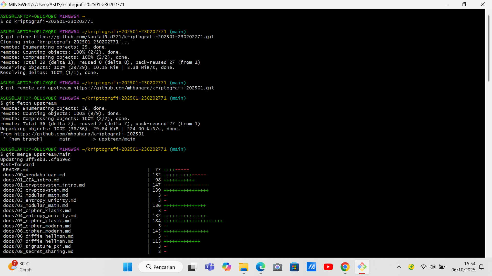

# Laporan Praktikum Kriptografi
Minggu ke-: 1 
Topik: Sejarah Kriptografi & Prinsip CIA
Nama: Naufal Raa'id  
NIM: 230202771  
Kelas: 5IKRB

---

## 1. Tujuan
1.Menjelaskan sejarah dan evolusi kriptografi dari masa klasik hingga modern.
2.Menyebutkan prinsip Confidentiality, Integrity, Availability (CIA) dengan benar.
3.Menyimpulkan peran kriptografi dalam sistem keamanan informasi modern.
4.Menyiapkan repositori GitHub sebagai media kerja praktikum.

---

## 2. Dasar Teori
Ringkasan Kriptografi
1.Era Kriptografi Klasik
   Kriptografi klasik merujuk pada teknik pengamanan informasi yang telah digunakan sejak zaman kuno. Salah satu contoh paling terkenal adalah Caesar Cipher, di mana setiap huruf dalam pesan digeser beberapa tempat dalam alfabet. Misalnya, dengan pergeseran tiga, huruf A menjadi D, huruf B menjadi E, dan seterusnya. Meskipun sederhana, metode ini mudah dipecahkan.

   Vigenère Cipher memperkenalkan kompleksitas lebih dalam kriptografi klasik. Teknik ini menggunakan kata kunci untuk menentukan pergeseran setiap huruf, sehingga setiap huruf dalam pesan dapat memiliki pergeseran yang berbeda. Ini memperbaiki kelemahan Caesar Cipher, namun tetap memiliki kerentanan terhadap analisis frekuensi.

2.Perkembangan Kriptografi Modern
   Dengan kemajuan teknologi dan kebutuhan akan keamanan informasi yang lebih tinggi, kriptografi modern lahir. Salah satu algoritma kunci simetris yang banyak digunakan adalah Advanced Encryption Standard (AES), yang menggantikan Data Encryption Standard (DES) yang lebih tua dan dianggap tidak aman. AES menggunakan ukuran kunci variabel (128, 192, atau 256 bit) dan dapat mengenkripsi data dalam blok 128 bit dengan efisiensi tinggi dan keamanan yang kuat.

   Di sisi lain, RSA (Rivest-Shamir-Adleman) adalah contoh algoritma kriptografi kunci publik. RSA memungkinkan pengiriman informasi secara aman tanpa perlu bertukar kunci secara langsung. Algoritma ini berdasarkan kesulitan pemfaktoran bilangan bulat dalam ukuran besar, sehingga menawarkan tingkat keamanan yang signifikan untuk komunikasi digital.

3.Evolusi Menuju Kriptografi Kontemporer
   Seiring berkembangnya teknologi informasi, kriptografi terus berevolusi dan beradaptasi. Salah satu inovasi utama adalah penggunaan blockchain, yang berfungsi sebagai buku besar terdistribusi untuk mencatat transaksi secara aman dan transparan. Teknologi ini mendasari berbagai aplikasi, termasuk cryptocurrency, seperti Bitcoin dan Ethereum, yang menggunakan prinsip kriptografi untuk melindungi transaksi dan mengontrol penciptaan unit baru.

   Kriptografi saat ini juga melibatkan berbagai pendekatan dalam keamanan siber, termasuk teknik enkripsi berdasarkan algoritma kuantum yang berpotensi mengubah cara data dilindungi. Oleh karena itu, kriptografi tidak hanya berkisar pada pengamanan informasi, tetapi juga menjadi komponen penting dalam infrastruktur digital yang aman dan terdesentralisasi.

   Dengan segala perkembangan ini, kriptografi terus menjadi bidang yang bergerak cepat, beradaptasi dengan tantangan-tantangan baru dalam era digital.

---

## 3. Alat dan Bahan
(- Python 3.x  
- Visual Studio Code / editor lain  
- Git dan akun GitHub  
- Library tambahan (misalnya pycryptodome, jika diperlukan)  )

---

## 4. Langkah Percobaan
(Tuliskan langkah yang dilakukan sesuai instruksi.  
Contoh format:
1. Membuat file `caesar_cipher.py` di folder `praktikum/week2-cryptosystem/src/`.
2. Menyalin kode program dari panduan praktikum.
3. Menjalankan program dengan perintah `python caesar_cipher.py`.)

---

## 5. Source Code
(Salin kode program utama yang dibuat atau dimodifikasi.  
Gunakan blok kode:

```python
# contoh potongan kode
def encrypt(text, key):
    return ...
```
)

---

## 6. Hasil dan Pembahasan
(- Lampirkan screenshot hasil eksekusi program (taruh di folder `screenshots/`).  
- Berikan tabel atau ringkasan hasil uji jika diperlukan.  
- Jelaskan apakah hasil sesuai ekspektasi.  
- Bahas error (jika ada) dan solusinya. 

Hasil eksekusi program Caesar Cipher:



)

---

## 7. Jawaban Pertanyaan
- Pertanyaan 1:Tokoh yang secara luas dianggap sebagai Bapak Kriptografi Modern adalah Claude Shannon.

Alasannya:
Claude Shannon, seorang matematikawan dan insinyur Amerika, menerbitkan paper legendaris pada tahun 1949 berjudul "Communication Theory of Secrecy Systems". Dalam paper ini, ia untuk pertama kalinya meletakkan fondasi teori kriptografi dengan cara yang ilmiah dan matematis. Konsep-konsep kunci yang diperkenalkannya antara lain:
Teori Entropi dalam Kriptografi: Menggunakan ukuran ketidakpastian (entropi) untuk mengukur jumlah informasi dalam pesan dan kekuatan kunci.
Diffusion (Difusi) dan Confusion (Kebingungan): Dua properti dasar yang harus dimiliki cipher yang aman. Difusi menyebarkan struktur statistik plainteks ke dalam cipherteks, sementara Kebingungan membuat hubungan antara kunci dan cipherteks menjadi sangat kompleks. Meskipun tokoh lain seperti Whitfield Diffie, Martin Hellman, dan Ralph Merkle sangat berjasa dalam menemukan kriptografi kunci publik, gelar "Bapak Kriptografi Modern" lebih sering dikaitkan dengan Claude Shannon karena karya teoretisnya yang revolusioner.

- Pertanyaan 2: Berikut adalah beberapa algoritma kunci publik yang paling populer dan banyak digunakan:

RSA (Rivest-Shamir-Adleman): Algoritma yang paling terkenal dan banyak digunakan. Keamanannya berdasar pada kesulitan memfaktorkan bilangan bulat besar yang merupakan hasil kali dua bilangan prima besar. Digunakan untuk enkripsi dan tanda tangan digital.

ECC (Elliptic Curve Cryptography): Semakin populer karena menawarkan tingkat keamanan yang setara dengan RSA tetapi dengan ukuran kunci yang jauh lebih pendek. Ini sangat efisien untuk perangkat dengan sumber daya terbatas seperti ponsel dan kartu pintar.

Diffie-Hellman Key Exchange (DH): Bukan untuk enkripsi langsung, tetapi merupakan protokol yang memungkinkan dua pihak yang belum pernah berkomunikasi sebelumnya untuk membuat kunci rahasia bersama melalui saluran yang tidak aman. Versi yang menggunakan elliptic curve disebut ECDH (Elliptic-Curve Diffie-Hellman) dan sangat umum digunakan.

DSA (Digital Signature Algorithm): Digunakan secara khusus untuk tanda tangan digital. Standar pemerintah AS ini sering menjadi alternatif untuk tanda tangan digital RSA.

ElGamal: Sebuah algoritma yang dapat digunakan untuk enkripsi dan tanda tangan digital. Meskipun kurang populer daripada RSA untuk enkripsi, prinsipnya menjadi dasar bagi DSA.

- Pertanyaan 3: Tentu, berikut penjelasan untuk perbedaan utama antara kriptografi klasik dan modern tanpa menggunakan tabel:

Perbedaan utama antara kriptografi klasik dan modern terletak pada fondasi, ruang lingkup, dan kompleksitasnya.

Pertama, dari segi dasar keamanan, kriptografi klasik bergantung pada kerahasiaan algoritma itu sendiri (disebut "security by obscurity"). Cara kerja cipher dirahasiakan agar sistem tetap aman. Sebaliknya, kriptografi modern menganut Prinsip Kerckhoffs, di mana algoritma dianggap sudah diketahui publik, dan keamanan seluruhnya bergantung pada kerahasiaan kunci.

Kedua, dari segi jenis kunci, kriptografi klasik hanya menggunakan kunci simetris, di mana kunci yang sama digunakan untuk proses enkripsi dan dekripsi. Hal ini menimbulkan masalah besar dalam mendistribusikan kunci secara aman. Kriptografi modern melakukan revolusi dengan memperkenalkan kriptografi kunci asimetris (kunci publik), yang menggunakan sepasang kunci (publik dan privat) dan memecahkan masalah distribusi kunci yang dihadapi era klasik.

Ketiga, dari segi ruang lingkup dan tujuan, kriptografi klasik hanya berfokus pada satu tujuan: kerahasiaan data. Sementara itu, kriptografi modern memiliki cakupan yang jauh lebih luas, yang tidak hanya menjamin kerahasiaan, tetapi juga integritas data (memastikan data tidak diubah), autentikasi (memverifikasi identitas), dan non-repudiation (mencegah pihak menyangkal tindakan mereka melalui tanda tangan digital).

Terakhir, dari segi dasar ilmu, kriptografi klasik lebih merupakan sebuah "seni" yang berbasis pada manipulasi karakter atau huruf. Sebaliknya, kriptografi modern adalah sebuah "ilmu" yang kokoh berbasis pada fondasi matematika yang kompleks, seperti teori bilangan dan aljabar abstrak.

Secara singkat, transisi dari kriptografi klasik ke modern adalah lompatan dari seni yang sederhana dan tertutup menjadi ilmu yang kompleks, terbuka, dan serba guna, dengan penemuan kunci asimetris sebagai pembeda yang paling revolusioner.


---

## 8. Kesimpulan
Kriptografi telah berkembang dari metode penyandian sederhana pada zaman kuno, seperti sandi Caesar, hingga menjadi sistem keamanan digital yang kompleks di era modern. Tujuan utamanya tetap sama, yaitu melindungi informasi agar tidak dapat diakses oleh pihak yang tidak berwenang.
---

## 9. Daftar Pustaka
(Cantumkan referensi yang digunakan.  
Contoh:  
- Katz, J., & Lindell, Y. *Introduction to Modern Cryptography*.  
- Stallings, W. *Cryptography and Network Security*.  )

---

## 10. Commit Log
(Tuliskan bukti commit Git yang relevan.  
Contoh:
```
commit 21466eed94f14a8d6218b7182ad9c6a9fcdd23ad (HEAD -> main)
Author: Naufal Raa'id <naufalraaid84@gmail.com>
Date:   Mon Oct 13 10:49:54 2025 +0700

    week2-cryptosystem: implementasi Caesar Cipher dan laporan )
```