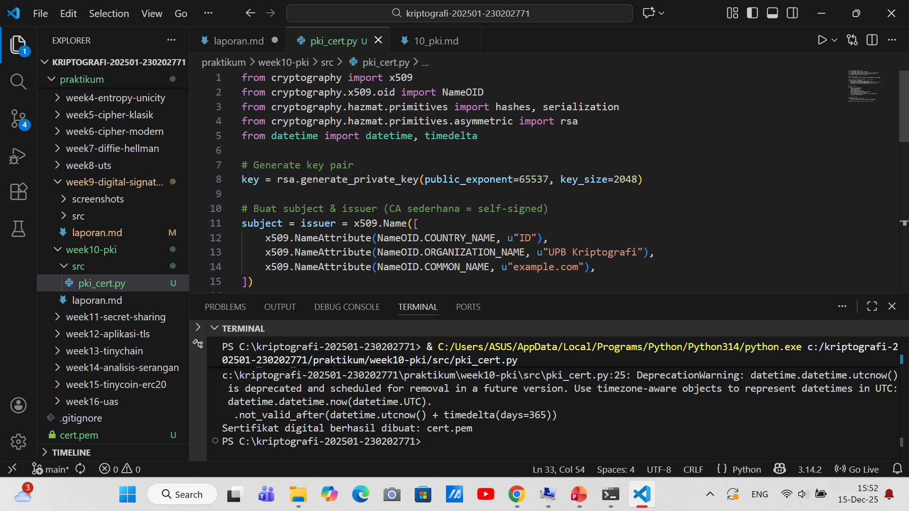

# Laporan Praktikum Kriptografi
Minggu ke-: 10  
Topik: Public Key Infrastructure (PKI & Certificate Authority)  
Nama: Naufal Raaid  
NIM: 2330202771  
Kelas: 5IKRB  

---

## 1. Tujuan
1. Membuat sertifikat digital sederhana.  
2. Menjelaskan peran Certificate Authority (CA) dalam sistem PKI.  
3. Mengevaluasi fungsi PKI dalam komunikasi aman (contoh: HTTPS, TLS).  

---

## 2. Dasar Teori
Certificate Authority (CA) merupakan komponen penting dalam Public Key Infrastructure (PKI) yang bertugas memverifikasi identitas suatu entitas dan menerbitkan sertifikat digital. Sertifikat ini mengaitkan identitas pemilik dengan public key yang digunakan dalam proses enkripsi dan autentikasi. Dengan adanya CA sebagai pihak tepercaya, pengguna dapat yakin bahwa komunikasi dilakukan dengan entitas yang sah.

Self-signed certificate adalah sertifikat yang ditandatangani oleh pemiliknya sendiri tanpa verifikasi dari CA. Sertifikat jenis ini tidak dipercaya secara default oleh browser atau sistem operasi sehingga menimbulkan peringatan keamanan. Oleh karena itu, self-signed certificate hanya cocok digunakan pada lingkungan pengujian (development), bukan pada sistem produksi yang membutuhkan tingkat keamanan dan kepercayaan tinggi.

PKI bekerja bersama protokol TLS/HTTPS untuk mencegah serangan Man-In-The-Middle (MITM). Dalam proses TLS handshake, klien akan memverifikasi sertifikat server melalui rantai kepercayaan CA, memastikan kesesuaian domain dan masa berlaku sertifikat. Mekanisme ini memastikan bahwa kunci enkripsi digunakan hanya oleh pihak yang sah, sehingga komunikasi data tetap aman dan terjaga kerahasiaannya.

---

## 3. Alat dan Bahan
(- Python 3.14.2  
- Visual Studio Code / editor lain  
- Git dan akun GitHub  
- Library tambahan (misalnya pycryptodome, jika diperlukan)  )

---

## 4. Langkah Percobaan
(Tuliskan langkah yang dilakukan sesuai instruksi.  
Contoh format:
1. Membuat file `pki_cert.py` di folder `praktikum/week10-pki/src/`.
2. Menyalin kode program dari panduan praktikum.
3. Menjalankan program dengan perintah `python pki_cert.py`.)

---

## 5. Source Code
(Salin kode program utama yang dibuat atau dimodifikasi.  
Gunakan blok kode:

```python
from cryptography import x509
from cryptography.x509.oid import NameOID
from cryptography.hazmat.primitives import hashes, serialization
from cryptography.hazmat.primitives.asymmetric import rsa
from datetime import datetime, timedelta

# Generate key pair
key = rsa.generate_private_key(public_exponent=65537, key_size=2048)

# Buat subject & issuer (CA sederhana = self-signed)
subject = issuer = x509.Name([
    x509.NameAttribute(NameOID.COUNTRY_NAME, u"ID"),
    x509.NameAttribute(NameOID.ORGANIZATION_NAME, u"UPB Kriptografi"),
    x509.NameAttribute(NameOID.COMMON_NAME, u"example.com"),
])

# Buat sertifikat
cert = (
    x509.CertificateBuilder()
    .subject_name(subject)
    .issuer_name(issuer)
    .public_key(key.public_key())
    .serial_number(x509.random_serial_number())
    .not_valid_before(datetime.utcnow())
    .not_valid_after(datetime.utcnow() + timedelta(days=365))
    .sign(key, hashes.SHA256())
)

# Simpan sertifikat
with open("cert.pem", "wb") as f:
    f.write(cert.public_bytes(serialization.Encoding.PEM))

print("Sertifikat digital berhasil dibuat: cert.pem")
```
)

---

## 6. Hasil dan Pembahasan
(- Lampirkan screenshot hasil eksekusi program (taruh di folder `screenshots/`).  
- Berikan tabel atau ringkasan hasil uji jika diperlukan.  
- Jelaskan apakah hasil sesuai ekspektasi.  
- Bahas error (jika ada) dan solusinya. 

Hasil eksekusi program Caesar Cipher:


)

---

## 7. Jawaban Pertanyaan
1. Apa fungsi utama Certificate Authority (CA)?
jawab: Fungsi utama Certificate Authority (CA) adalah memverifikasi identitas suatu entitas (server, organisasi, atau individu) dan menerbitkan sertifikat digital yang mengikat identitas tersebut dengan public key.
CA berperan sebagai pihak tepercaya yang:
-Menjamin keaslian identitas pemilik sertifikat
-Menandatangani sertifikat secara digital
-Menjadi dasar kepercayaan dalam komunikasi aman (TLS/HTTPS)  
2. Mengapa self-signed certificate tidak cukup untuk sistem produksi?
jawab: Self-signed certificate tidak cukup untuk sistem produksi karena tidak diverifikasi oleh pihak tepercaya (CA).
Kekurangannya:
Browser dan OS tidak mempercayainya secara default
Menimbulkan peringatan keamanan bagi pengguna
Rentan MITM, karena siapa pun bisa membuat sertifikat palsu
Tidak memenuhi standar keamanan dan kepatuhan (compliance)
Self-signed certificate hanya cocok untuk testing atau development, bukan produksi. 
3. Bagaimana PKI mencegah serangan MITM dalam komunikasi TLS/HTTPS
jawab: Public Key Infrastructure (PKI) mencegah serangan Man-In-The-Middle (MITM) dengan cara:
Validasi sertifikat server
Browser memeriksa apakah sertifikat ditandatangani oleh CA tepercaya
Verifikasi rantai sertifikat (certificate chain)
Dari server → intermediate CA → root CA
Pemeriksaan domain & masa berlaku
Sertifikat harus sesuai domain dan masih valid
Proses TLS handshake
Public key yang valid digunakan untuk negosiasi kunci enkripsi
Penyerang tidak bisa memalsukan sertifikat tanpa private key CA
Hasilnya: klien yakin bahwa ia berkomunikasi dengan server yang benar, bukan penyerang.

---

## 8. Kesimpulan
Certificate Authority (CA) berperan sebagai pihak tepercaya yang memverifikasi identitas dan menerbitkan sertifikat digital untuk menjamin keamanan komunikasi. Self-signed certificate tidak cukup untuk sistem produksi karena tidak divalidasi oleh CA dan berisiko terhadap serangan keamanan. Melalui PKI dan TLS/HTTPS, komunikasi dapat terlindungi dari serangan MITM dengan mekanisme validasi sertifikat dan enkripsi.

---

## 9. Daftar Pustaka
(Cantumkan referensi yang digunakan.  
Contoh:  
- Katz, J., & Lindell, Y. *Introduction to Modern Cryptography*.  
- Stallings, W. *Cryptography and Network Security*.  )

---

## 10. Commit Log
```
commit e1116be3be6ab3c4f8e3d2aae1529e88747028a5 (HEAD -> main, origin/main, origin/HEAD)
Author: Naufal Raaid <nraid834@gmail.com>
Date:   Mon Dec 15 16:07:17 2025 +0700

    week10-pki
```
