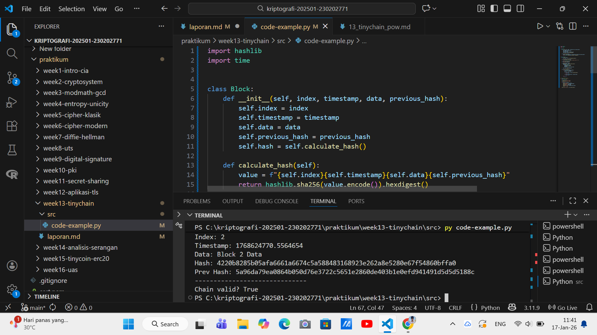

# Laporan Praktikum Kriptografi
Minggu ke-: 13
Topik: tiniychain-pow  
Nama: Naufal Raaid 
NIM: 230202771  
Kelas: 5IKRB  

---

## 1. Tujuan
Setelah mengikuti praktikum ini, mahasiswa diharapkan mampu:  
1. Menjelaskan peran **hash function** dalam blockchain.  
2. Melakukan simulasi sederhana **Proof of Work (PoW)**.  
3. Menganalisis keamanan cryptocurrency berbasis kriptografi.

---

## 2. Dasar Teori
Blockchain merupakan struktur data terdistribusi yang terdiri dari rangkaian blok yang saling terhubung menggunakan nilai hash. Setiap blok menyimpan data transaksi, timestamp, hash blok sebelumnya, serta nilai hash blok itu sendiri. Fungsi hash kriptografis seperti SHA-256 memiliki sifat deterministik, satu arah, dan tahan terhadap collision, sehingga sangat cocok digunakan untuk menjaga integritas data pada blockchain.

Proof of Work (PoW) adalah mekanisme konsensus yang mengharuskan penambang (miner) menyelesaikan persoalan komputasi dengan mencari nilai nonce tertentu agar hash blok memenuhi tingkat kesulitan (difficulty) yang ditentukan. Proses ini membutuhkan sumber daya komputasi yang signifikan sehingga mempersulit penyerang untuk memodifikasi data pada blockchain.

Keamanan PoW bergantung pada fakta bahwa untuk mengubah satu blok, penyerang harus melakukan ulang proses mining tidak hanya pada blok tersebut, tetapi juga seluruh blok setelahnya, yang secara komputasi sangat mahal dan tidak efisien.

---

## 3. Alat dan Bahan
- Python 3.11.9  
- Visual Studio Code / editor lain  
- Git dan akun GitHub  
- Library tambahan (hashlib, time)  

---

## 4. Langkah Percobaan
(Tuliskan langkah yang dilakukan sesuai instruksi.  
Contoh format:
1. Membuat file `tinychain.py` di folder `praktikum/week2-cryptosystem/src/`.
2. Menyalin kode program dari panduan praktikum.
3. Menjalankan program dengan perintah `python caesar_cipher.py`.)

---

## 5. Source Code
(Salin kode program utama yang dibuat atau dimodifikasi.  
Gunakan blok kode:

```python
import hashlib
import time


class Block:
    def __init__(self, index, timestamp, data, previous_hash):
        self.index = index
        self.timestamp = timestamp
        self.data = data
        self.previous_hash = previous_hash
        self.hash = self.calculate_hash()

    def calculate_hash(self):
        value = f"{self.index}{self.timestamp}{self.data}{self.previous_hash}"
        return hashlib.sha256(value.encode()).hexdigest()


class TinyChain:
    def __init__(self):
        self.chain = [self.create_genesis_block()]

    def create_genesis_block(self):
        return Block(0, time.time(), "Genesis Block", "0")

    def get_latest_block(self):
        return self.chain[-1]

    def add_block(self, data):
        latest_block = self.get_latest_block()
        new_block = Block(
            index=len(self.chain),
            timestamp=time.time(),
            data=data,
            previous_hash=latest_block.hash
        )
        self.chain.append(new_block)

    def is_chain_valid(self):
        for i in range(1, len(self.chain)):
            current = self.chain[i]
            previous = self.chain[i - 1]

            if current.hash != current.calculate_hash():
                return False

            if current.previous_hash != previous.hash:
                return False

        return True


# ====== TESTING ======
if __name__ == "__main__":
    tc = TinyChain()

    tc.add_block("Block 1 Data")
    tc.add_block("Block 2 Data")

    for block in tc.chain:
        print("Index:", block.index)
        print("Timestamp:", block.timestamp)
        print("Data:", block.data)
        print("Hash:", block.hash)
        print("Prev Hash:", block.previous_hash)
        print("-" * 30)

    print("Chain valid?", tc.is_chain_valid())
```
)

---

## 6. Hasil dan Pembahasan
(- Lampirkan screenshot hasil eksekusi program (taruh di folder `screenshots/`).  
- Berikan tabel atau ringkasan hasil uji jika diperlukan.  
- Jelaskan apakah hasil sesuai ekspektasi.  
- Bahas error (jika ada) dan solusinya. 

Hasil eksekusi program Caesar Cipher:


)

---

## 7. Jawaban Pertanyaan
1. Mengapa fungsi hash sangat penting dalam blockchain?
Jawab:
-Menjaga integritas data: Setiap perubahan kecil pada data akan menghasilkan hash yang sama sekali berbeda, sehingga manipulasi data mudah terdeteksi.
-Menghubungkan blok: Setiap blok menyimpan hash dari blok sebelumnya, membentuk rantai (chain) yang sulit diubah tanpa mengubah seluruh blok setelahnya.
-Keamanan kriptografi: Fungsi hash bersifat satu arah (one-way), sehingga hampir mustahil menebak data asli dari nilai hash.
-Identitas transaksi dan blok: Hash digunakan sebagai penanda unik (fingerprint) untuk transaksi dan blok.  
2. Bagaimana Proof of Work mencegah double spending?
Jawab:
Proof of Work mencegah double spending dengan cara:
-Validasi terdesentralisasi: Semua transaksi diverifikasi oleh banyak node di jaringan, bukan oleh satu pihak.
-Konsensus jaringan: Transaksi hanya dianggap sah setelah dimasukkan ke dalam blok yang berhasil ditambang dan disetujui oleh mayoritas jaringan.
-Biaya komputasi tinggi: Untuk mengubah transaksi yang sudah tercatat, penyerang harus menambang ulang blok tersebut dan semua blok setelahnya, serta mengalahkan kekuatan komputasi mayoritas jaringan (serangan 51%), yang sangat mahal dan sulit dilakukan.
-Urutan transaksi yang jelas: Blockchain mencatat urutan transaksi secara kronologis, sehingga satu koin tidak bisa digunakan dua kali.  
3. Apa kelemahan dari PoW dalam hal efisiensi energi?
Jawab:
Kelemahan utama PoW dalam efisiensi energi adalah:

-Konsumsi energi sangat besar: Proses penambangan membutuhkan daya komputasi tinggi yang menghabiskan banyak listrik.
-Persaingan yang tidak efisien: Banyak penambang melakukan perhitungan yang sama, tetapi hanya satu yang menang, sehingga sebagian besar energi terbuang.
-Dampak lingkungan: Konsumsi energi besar sering kali bergantung pada sumber energi fosil, yang meningkatkan emisi karbon.
-Biaya operasional tinggi: Membutuhkan perangkat keras khusus dan listrik murah, sehingga cenderung memusatkan penambangan pada pihak tertentu.
---

## 8. Kesimpulan
Praktikum TinyChain–Proof of Work berhasil menunjukkan bagaimana fungsi hash kriptografis dan mekanisme Proof of Work digunakan untuk menjaga integritas dan keamanan blockchain. Proses mining membuktikan bahwa pencarian nilai nonce membutuhkan usaha komputasi yang signifikan sesuai tingk
at kesulitan yang ditetapkan. Dengan demikian, Proof of Work efektif dalam mencegah manipulasi data dan double spending, meskipun memiliki kelemahan pada konsumsi energi yang tinggi.

---

## 9. Daftar Pustaka
(Cantumkan referensi yang digunakan.  
Contoh:  
- Katz, J., & Lindell, Y. *Introduction to Modern Cryptography*.  
- Stallings, W. *Cryptography and Network Security*.  )

---

## 10. Commit Log

```
commit ac810d10f7af1acdf7aef6331ded05e9d32bebfb (HEAD -> main, origin/main, origin/HEAD)
Author: Naufal Raaid <nraid834@gmail.com>
Date:   Sat Jan 17 14:16:14 2026 +0700

    week13-tinychain
```
