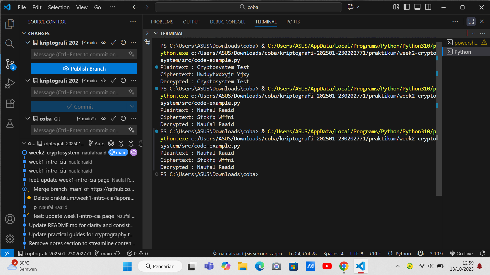

# Laporan Praktikum Kriptografi
Minggu ke-: 2
Topik: [Cryptosystem (Komponen, Enkripsi & Dekripsi, Simetris & Asimetris)]  
Nama: [Naufal Raaid]  
NIM: 230202771
Kelas: 5IKRB  

---

## 1. Tujuan
Setelah mengikuti praktikum ini, mahasiswa diharapkan mampu:  
1. Mengidentifikasi komponen dasar kriptosistem (plaintext, ciphertext, kunci, algoritma).  
2. Menggambarkan proses enkripsi dan dekripsi sederhana.  
3. Mengklasifikasikan jenis kriptosistem (simetris dan asimetris).

---

# 2. Dasar Teori
Berikut definisi dan penjelasan tentang cipher klasik dan konsep modular aritmetika:

#  CIPHER KLASIK

# Definisi:
Cipher klasik adalah metode enkripsi tradisional yang digunakan sebelum era komputer modern, biasanya bekerja pada karakter per karakter atau huruf per huruf.

# Jenis-jenis Cipher Klasik:

# 1. Substitution Cipher (Cipher Substitusi)
- Caesar Cipher: Menggeser setiap huruf sejumlah posisi tertentu
  ```python
  # Contoh: Geser 3 posisi
  Plaintext:  HELLO
  Ciphertext: KHOOR
  ```

- Monoalphabetic Cipher: Substitusi satu huruf dengan huruf lain secara acak
- Polyalphabetic Cipher (Vigenère): Menggunakan kunci untuk menentukan multiple shift

# 2. Transposition Cipher (Cipher Transposisi)
- Rail Fence Cipher: Menulis plaintext secara zig-zag
- Columnar Transposition: Menulis plaintext dalam kolom, lalu membaca dengan urutan berbeda

# Karakteristik Cipher Klasik:
- Operasi pada alfabet (biasa A-Z)
- Tidak menggunakan operasi matematika kompleks
- Rentan terhadap analisis frekuensi
- Implementasi manual/sederhana

# KONSEP MODULAR ARITMETIKA

# Definisi:
Aritmetika modular adalah sistem aritmetika untuk bilangan bulat yang membatasi angka dalam rentang 0 sampai (modulus - 1).

# Konsep Dasar:
```python
a ≡ b (mod m)  # Dibaca: "a kongruen dengan b modulo m"
```
Artinya: (a - b) habis dibagi m, atau a dan b memberikan sisa yang sama ketika dibagi m.

# Operasi Modular:
```python
# Contoh modulo 26 (untuk alfabet)
15 + 10 ≡ 25 (mod 26)
15 + 12 ≡ 1  (mod 26)  # Karena 27 ÷ 26 = 1 sisa 1
```

# Sifat-sifat Penting:
1. Komutatif: 
   - a + b ≡ b + a (mod m)
   - a × b ≡ b × a (mod m)

2. Asosiatif: 
   - (a + b) + c ≡ a + (b + c) (mod m)

3. Distributif: 
   - a × (b + c) ≡ (a × b) + (a × c) (mod m)

# Aplikasi dalam Kriptografi:
```python
# Caesar Cipher menggunakan modular arithmetic
Enkripsi: C = (P + K) mod 26
Dekripsi: P = (C - K) mod 26

Dimana:
P = Plaintext (0-25)
C = Ciphertext (0-25) 
K = Kunci (shift)
```

# Invers Modular:
```python
# Mencari invers perkalian
a × a⁻¹ ≡ 1 (mod m)

# Contoh: invers 3 mod 26
3 × 9 = 27 ≡ 1 (mod 26)
# Jadi invers 3 mod 26 adalah 9
```

# HUBUNGAN KEDUANYA:

Cipher klasik seperti Caesar Cipher dan Vigenère Cipher menggunakan modular arithmetic untuk operasi pergeseran huruf, terutama dengan modulus 26 (jumlah huruf alfabet).

Contoh Implementasi:
```python
def caesar_encrypt(plaintext, shift):
    ciphertext = ""
    for char in plaintext.upper():
        if char.isalpha():
            # Konversi ke angka (0-25), geser, mod 26, konversi kembali ke huruf
            encrypted_char = chr((ord(char) - 65 + shift) % 26 + 65)
            ciphertext += encrypted_char
    return ciphertext
```

---

## 3. Alat dan Bahan
(- Python 3.x  
- Visual Studio Code / editor lain  
- Git dan akun GitHub  
- Library tambahan (misalnya pycryptodome, jika diperlukan)  )

---

## 4. Langkah Percobaan
(Tuliskan langkah yang dilakukan sesuai instruksi.  
Contoh format:
1. Membuat file `simple_crypto.py` di folder `praktikum/week2-cryptosystem/src/`.
2. Menyalin kode program dari panduan praktikum.
3. Menjalankan program dengan perintah `python simple_crypto.py`.)

---

## 5. Source Code
(Salin kode program utama yang dibuat atau dimodifikasi.  
Gunakan blok kode:

```python
# contoh potongan kode
# file: praktikum/week2-cryptosystem/src/simple_crypto.py

def encrypt(plaintext, key):
    result = ""
    for char in plaintext:
        if char.isalpha():
            shift = 65 if char.isupper() else 97
            result += chr((ord(char) - shift + key) % 26 + shift)
        else:
            result += char
    return result

def decrypt(ciphertext, key):
    result = ""
    for char in ciphertext:
        if char.isalpha():
            shift = 65 if char.isupper() else 97
            result += chr((ord(char) - shift - key) % 26 + shift)
        else:
            result += char
    return result

if __name__ == "__main__":
    message = "Naufal Raaid"
    key = 5

    enc = encrypt(message, key)
    dec = decrypt(enc, key)

    print("Plaintext :", message)
    print("Ciphertext:", enc)
    print("Decrypted :", dec)
```
)

---

## 6. Hasil dan Pembahasan
- Lampirkan screenshot hasil eksekusi program (taruh di folder `screenshots/`).  
- Berikan tabel atau ringkasan hasil uji jika diperlukan.  
- Jelaskan apakah hasil sesuai ekspektasi.  
- Bahas error (jika ada) dan solusinya. 

Hasil eksekusi program Caesar Cipher:




---

## 7. Jawaban Pertanyaan
(Jawab pertanyaan diskusi yang diberikan pada modul.  
- Pertanyaan 1: Komponen utama dalam kriptosistem adalah:
Plaintext → Pesan asli yang akan dienkripsi.
Ciphertext → Pesan yang sudah dienkripsi (hasil penyandian).
Algoritma enkripsi → Proses atau rumus untuk mengubah plaintext menjadi ciphertext.
Algoritma dekripsi → Proses untuk mengembalikan ciphertext menjadi plaintext.
Kunci (key) → Nilai rahasia yang digunakan dalam proses enkripsi dan dekripsi.
Manajemen kunci → Prosedur untuk distribusi, penyimpanan, dan perlindungan kunci.
- Pertanyaan 2: Kelebihan:Lebih cepat dan efisien untuk data besar.
Algoritmanya lebih sederhana.
Tidak perlu berbagi kunci rahasia secara langsung.
Lebih aman untuk komunikasi terbuka 
Kelemahan:
Distribusi kunci sulit (harus dikirim secara aman).
Tidak cocok untuk komunikasi banyak pihak.
Proses enkripsi/dekripsi lebih lambat.
Lebih kompleks dan memerlukan sumber daya lebih.
- Pertanyaan 3: Distribusi kunci menjadi masalah utama karena:
Dalam sistem simetris, pengirim dan penerima harus memiliki kunci yang sama, dan kunci tersebut harus dijaga kerahasiaannya. Jika kunci disadap saat dikirim, maka seluruh komunikasi dapat dibobol karena pihak penyadap dapat mengenkripsi dan mendekripsi pesan.
)
---

## 8. Kesimpulan
Cryptosystem (Sistem Kriptografi)
Komponen Cryptosystem:
- Plaintext: Pesan asli yang dapat dibaca dan dimengerti.
- Ciphertext: Pesan hasil enkripsi yang tidak dapat dibaca tanpa dekripsi.
- Kunci (Key): Data rahasia yang digunakan dalam proses enkripsi dan dekripsi.
- Algoritma Enkripsi: Fungsi matematika yang mengubah plaintext menjadi ciphertext menggunakan kunci.
- Algoritma Dekripsi: Fungsi matematika yang mengubah ciphertext kembali menjadi plaintext menggunakan kunci.

Proses Enkripsi dan Dekripsi:
- Enkripsi: Proses mengubah plaintext menjadi ciphertext untuk menyembunyikan informasi.
- Dilakukan dengan algoritma enkripsi dan kunci.
- Dekripsi: Proses mengembalikan ciphertext menjadi plaintext asli.
- Dilakukan dengan algoritma dekripsi dan kunci (yang dapat sama atau berbeda dengan kunci enkripsi).

Jenis Cryptosystem Berdasarkan Kunci:

- Kriptografi Simetris (Symmetric Cryptography):
- Menggunakan kunci yang sama untuk enkripsi dan dekripsi.

Contoh algoritma: AES (Advanced Encryption Standard), DES (Data Encryption Standard), 3DES, ChaCha20.

- Kelebihan: Proses enkripsi dan dekripsi cepat, cocok untuk data besar.
- Kekurangan: Distribusi kunci yang aman menjadi tantangan.
- Kriptografi Asimetris (Asymmetric Cryptography):
- Menggunakan sepasang kunci: kunci publik (public key) dan kunci privat (private key).
- Kunci publik digunakan untuk enkripsi, sedangkan kunci privat untuk dekripsi.

Contoh algoritma: RSA, ElGamal, Elliptic Curve Cryptography (ECC).

- Kelebihan: Memecahkan masalah distribusi kunci, digunakan untuk digital signature dan pertukaran kunci.
- Kekurangan: Proses lebih lambat dibanding kriptografi simetris.

Kesimpulan:

- Cryptosystem adalah sistem yang digunakan untuk melindungi kerahasiaan dan integritas data.
- Terdiri dari komponen plaintext, ciphertext, kunci, dan algoritma.
- Proses enkripsi mengamankan data, sementara dekripsi mengembalikannya.
- Kriptografi simetris menggunakan kunci yang sama, sedangkan asimetris menggunakan pasangan kunci publik dan privat.
- Kedua jenis kriptografi ini sering digunakan bersama, misalnya dalam pertukaran kunci simetris dengan kriptografi asimetris, lalu enkripsi data dengan kunci simetris.

---

## 9. Daftar Pustaka
(Cantumkan referensi yang digunakan.  
Contoh:  
- Katz, J., & Lindell, Y. *Introduction to Modern Cryptography*.  
- Stallings, W. *Cryptography and Network Security*.  )

---

## 10. Commit Log
(Tuliskan bukti commit Git yang relevan.  
Contoh:
```
commit 21466eed94f14a8d6218b7182ad9c6a9fcdd23ad (HEAD -> main)
Author: Naufal Raa'id <nraid834@gmail.com>
Date:   Mon Oct 13 10:49:54 2025 +0700

    week2-cryptosystem: implementasi Caesar Cipher dan laporan )
```
# Laporan Week 2 - Cryptosystem

Ini isi laporan saya...

# test perubahan
