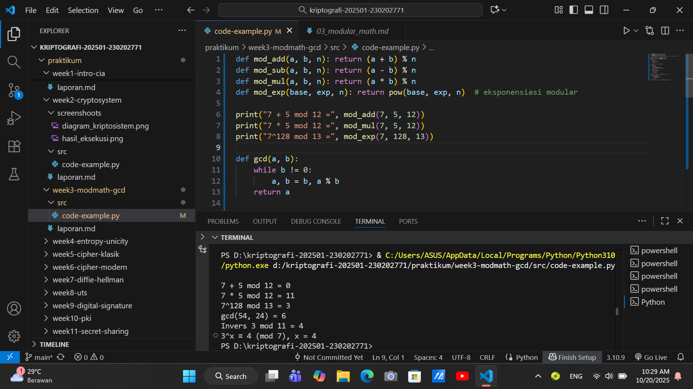

# Laporan Praktikum Kriptografi
Minggu ke-: 3 
Topik: Modular Math (Aritmetika Modular, GCD, Bilangan Prima, Logaritma Diskrit)  
Nama: Naufal Raa'id
NIM: 230202771  
Kelas:5IKRB   

---

## 1. Tujuan
1.Menyelesaikan operasi aritmetika modular.
2.Menentukan bilangan prima dan menghitung GCD (Greatest Common Divisor).
3.Menerapkan logaritma diskrit sederhana dalam simulasi kriptografi.

---

## 2. Dasar Teori
Aritmetika modular merupakan sistem aritmetika yang menggunakan operasi berdasarkan sisa hasil pembagian. Dalam sistem ini, dua bilangan dianggap kongruen jika memiliki sisa pembagian yang sama terhadap suatu modulus. Operasi modular banyak digunakan dalam kriptografi, terutama pada algoritma seperti RSA dan Diffie-Hellman.

Algoritma Euclidean digunakan untuk mencari pembagi bersama terbesar (GCD) antara dua bilangan. Versi Extended Euclidean Algorithm memungkinkan kita menemukan invers modular, yaitu bilangan 
𝑥x yang memenuhi 𝑎×x≡
(mod𝑛)a×x≡1(modn).

Logaritma diskrit merupakan kebalikan dari eksponensiasi modular, yaitu mencari 
𝑥x pada persamaan 𝑎𝑥≡𝑏(mod𝑛)ax≡b(modn). Masalah ini sangat sulit diselesaikan untuk modulus besar, dan karenanya menjadi dasar keamanan banyak sistem kriptografi modern.

---

## 3. Alat dan Bahan
(- Python 3.x  
- Visual Studio Code / editor lain  
- Git dan akun GitHub  
- Library tambahan (misalnya pycryptodome, jika diperlukan)  )

---

## 4. Langkah Percobaan
(Tuliskan langkah yang dilakukan sesuai instruksi.  
Contoh format:
1. Membuat file `modular_math.py` di folder `praktikum/week3-modmath-gcd/src/`.
2. Menyalin kode program dari panduan praktikum.
3. Menjalankan program dengan perintah `python modular_math.py`.)

---

## 5. Source Code
(Salin kode program utama yang dibuat atau dimodifikasi.  
Gunakan blok kode:

```python
# contoh potongan kode
#file: praktikum/week3-modmath-gcd/src/modular_math.py

def mod_add(a, b, n): return (a + b) % n
def mod_sub(a, b, n): return (a - b) % n
def mod_mul(a, b, n): return (a * b) % n
def mod_exp(base, exp, n): return pow(base, exp, n)  # eksponensiasi modular

print("7 + 5 mod 12 =", mod_add(7, 5, 12))
print("7 * 5 mod 12 =", mod_mul(7, 5, 12))
print("7^128 mod 13 =", mod_exp(7, 128, 13))

def gcd(a, b):
    while b != 0:
        a, b = b, a % b
    return a

print("gcd(54, 24) =", gcd(54, 24))

def egcd(a, b):
    if a == 0:
        return b, 0, 1
    g, x1, y1 = egcd(b % a, a)
    return g, y1 - (b // a) * x1, x1

def modinv(a, n):
    g, x, _ = egcd(a, n)
    if g != 1:
        return None
    return x % n

print("Invers 3 mod 11 =", modinv(3, 11))  # hasil: 4

def discrete_log(a, b, n):
    for x in range(n):
        if pow(a, x, n) == b:
            return x
    return None

print("3^x ≡ 4 (mod 7), x =", discrete_log(3, 4, 7))  # hasil: 4
```
)

---

## 6. Hasil dan Pembahasan
(- Lampirkan screenshot hasil eksekusi program (taruh di folder `screenshots/`).  
- Berikan tabel atau ringkasan hasil uji jika diperlukan.  
- Jelaskan apakah hasil sesuai ekspektasi.  
- Bahas error (jika ada) dan solusinya. 

Hasil eksekusi program Caesar Cipher:


)

---

## 7. Jawaban Pertanyaan
Perannya antara lain:

1.-Menyediakan ruang bilangan terbatas (mod n) tempat operasi matematika dilakukan, sehingga hasil operasi selalu “terbungkus” di dalam kisaran tertentu.
-Memungkinkan fungsi satu arah (one-way function), yaitu operasi yang mudah dilakukan tetapi sulit dibalik (misalnya, mengalikan dua bilangan prima besar mudah, tetapi memfaktorkan hasilnya sangat sulit).
Digunakan untuk operasi enkripsi, dekripsi, tanda tangan digital, dan pertukaran kunci melalui operasi seperti perpangkatan modular:
𝐶 = 𝑀<sup>𝑒</sup> mod 𝑛 di mana 𝑀M adalah pesan, 𝑒e eksponen publik, dan 𝑛n modulus.

2.Pentingnya invers modular dalam algoritma kunci publik (contoh: RSA)

Invers modular diperlukan untuk menghitung kunci privat dari kunci publik.

Dalam RSA:

Kunci publik terdiri dari (𝑒,𝑛)
Kunci privat adalah 𝑑, yang merupakan invers modular dari e terhadap 𝜑(𝑛):e⋅d≡1(modφ(n))

Artinya, d hanya ada jika e dan 𝜑(n) relatif prima.
Tanpa invers modular, proses dekripsi tidak akan membalik hasil enkripsi karena operasi 
𝑀𝑒 𝑑 mo 𝑛=𝑀Med modn=M tidak akan berlaku.

Jadi, invers modular memastikan adanya simetri matematis antara proses enkripsi dan dekripsi dalam sistem kunci publik.

3. Tantangan utama dalam menyelesaikan logaritma diskrit untuk modulus besar

Masalah logaritma diskrit (Discrete Logarithm Problem, DLP) adalah inti dari keamanan banyak algoritma (misalnya Diffie–Hellman, ElGamal, ECC).

Tantangan utamanya:

Untuk bilangan besar (misalnya 2048 bit), tidak ada algoritma efisien (polinomial) yang dapat menghitung eksponen 𝑥 dari: 𝑔<sup>𝑥</sup>≡ 𝑦 (mod 𝑝)meskipun 𝑔,𝑦,dan 𝑝 diketahui.

Kompleksitas waktu meningkat super-polynomial atau eksponensial terhadap ukuran modulus.

Algoritma terbaik yang ada (misalnya Number Field Sieve) masih sangat lambat untuk modulus besar (ratusan atau ribuan bit).

Karena itulah, DLP dianggap sulit secara komputasional, dan kesulitan inilah yang menjamin keamanan sistem kriptografi berbasis logaritma diskrit.

---

## 8. Kesimpulan
Aritmetika modular adalah sistem perhitungan yang dilakukan berdasarkan sisa hasil bagi dari suatu bilangan terhadap modulus tertentu. Dalam sistem ini, dua bilangan dianggap ekivalen (kongruen) jika memiliki sisa pembagian yang sama terhadap modulus tersebut.

Dalam konteks kriptografi modern, aritmetika modular memiliki peran yang sangat penting karena:

Menjadi dasar operasi matematika dalam algoritma enkripsi dan dekripsi.

Memungkinkan pembentukan fungsi satu arah yang mudah dilakukan namun sulit dibalik, sehingga menjamin keamanan data.

Digunakan dalam berbagai algoritma kriptografi seperti RSA, Diffie–Hellman, dan ElGamal, serta dalam kriptografi kurva eliptik (ECC).

Secara singkat:

Aritmetika modular adalah fondasi matematis utama yang memungkinkan keamanan, efisiensi, dan keandalan sistem kriptografi modern. 

---

## 9. Daftar Pustaka
(Cantumkan referensi yang digunakan.  
Contoh:  
- Katz, J., & Lindell, Y. *Introduction to Modern Cryptography*.  
- Stallings, W. *Cryptography and Network Security*.  )

---

## 10. Commit Log
(Tuliskan bukti commit Git yang relevan.  
Contoh:
```
commit abc12345
Author: Naufal Raa'id <nraid834@gmail.com>
Date:   2025-09-20

    week2-cryptosystem: implementasi Caesar Cipher dan laporan )
```
