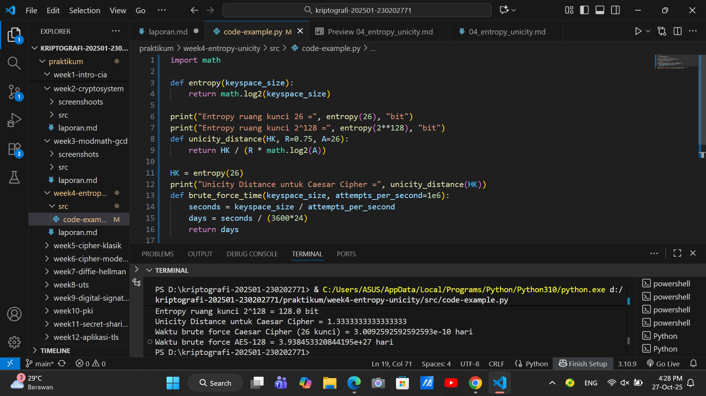

# Laporan Praktikum Kriptografi
Minggu ke-: 4
Topik: Entropy & Unicity Distance (Evaluasi Kekuatan Kunci dan Brute Force) 
Nama: [Naufal Raaid]  
NIM: 230202771  
Kelas: 5IKRB 

---

## 1. Tujuan
Setelah mengikuti praktikum ini, mahasiswa diharapkan mampu:  
1. Menyelesaikan perhitungan sederhana terkait entropi kunci.  
2. Menggunakan teorema Euler pada contoh perhitungan modular & invers.  
3. Menghitung **unicity distance** untuk ciphertext tertentu.  
4. Menganalisis kekuatan kunci berdasarkan entropi dan unicity distance.  
5. Mengevaluasi potensi serangan brute force pada kriptosistem sederhana

---

## 2. Dasar Teori
1. Pengertian Cipher

Cipher adalah metode atau algoritma yang digunakan untuk mengubah pesan asli (plaintext) menjadi pesan tersandi (ciphertext) agar tidak dapat dibaca oleh pihak yang tidak berwenang.
Proses ini disebut enkripsi (encryption), sedangkan proses mengembalikan ciphertext menjadi plaintext disebut dekripsi (decryption).

Secara umum: Ciphertext = $E_k(\text{Plaintext})$ Plaintext = $D_k(\text{Ciphertext})$ 

dengan $E_k$ = fungsi enkripsi menggunakan kunci 𝑘, dan $D_k$ = fungsi dekripsi menggunakan kunci yang sama atau berbeda tergantung jenis cipher-nya.

2. Cipher Klasik

Cipher klasik adalah bentuk awal dari kriptografi yang mengandalkan manipulasi huruf atau karakter dalam alfabet. Cipher jenis ini tidak melibatkan komputer dan biasanya menggunakan operasi aritmetika sederhana.

Beberapa jenis cipher klasik yang umum:

a. Cipher Substitusi

Setiap huruf dalam plaintext diganti dengan huruf lain sesuai aturan tertentu.

Contoh: Caesar Cipher
Menggeser setiap huruf sejauh n posisi dalam alfabet.

𝐶 = (𝑃+𝑘) mod 26
𝑃 = (𝐶−𝑘) mod 26

di mana:
𝑃 = huruf plaintext
𝐶 = huruf ciphertext
𝑘 = jumlah pergeseran
operasi dilakukan dalam modulo 26 (karena alfabet A–Z ada 26 huruf)

b. Cipher Transposisi

Cipher ini tidak mengganti huruf, tetapi mengubah urutan huruf dalam pesan.

Contoh: “KRIPTOGRAFI” → “KRTIPOGARFI” (setelah disusun ulang dengan pola tertentu)

3. Konsep Modular Aritmetika

Konsep ini sangat penting dalam kriptografi klasik dan modern.

Aritmetika modular berarti perhitungan dilakukan berdasarkan sisa hasil bagi terhadap suatu bilangan tertentu (modulus).

Contoh:

17 mod 5 = 2

karena 17 dibagi 5 sisanya 2.

Dalam cipher seperti Caesar atau Affine Cipher, kita menggunakan modular aritmetika agar hasil pergeseran huruf tetap berada dalam rentang 0–25 (huruf A–Z).

a. Affine Cipher

Affine Cipher adalah kombinasi antara substitusi linier dan modular aritmetika:

𝐶 = (𝑎𝑃+𝑏) mod 26
𝑃 = 𝑎<sup>-1</sup> (𝐶−𝑏) mod 26

dengan:

𝑎,𝑏 = kunci
𝑎−<sup>-1</sup> = invers modulo dari 
(yakni nilai yang memenuhi 𝑎×𝑎<sup>-1</sup> ≡ 1 (mod 26))

Contoh:
Jika 𝑎 = 5,𝑏 = 8

𝐶 = (5𝑃+8) mod26

4. Kunci dan Keamanan

Dalam cipher klasik:

Kunci (key) biasanya berupa angka pergeseran atau tabel substitusi.

Keamanannya bergantung pada kerahasiaan algoritma dan kunci.

Cipher klasik relatif mudah dipecahkan dengan analisis frekuensi atau brute force
---

## 3. Alat dan Bahan
(- Python 3.x  
- Visual Studio Code / editor lain  
- Git dan akun GitHub  
- Library tambahan (math)  )

---

## 4. Langkah Percobaan
(Tuliskan langkah yang dilakukan sesuai instruksi.  
Contoh format:
1. Membuat file `entropy_unicity.py` di folder `praktikum/week4-entropy-unicity/src/`.
2. Menyalin kode program dari panduan praktikum.
3. Menjalankan program dengan perintah `python entropy_unicity.py`.)

---

## 5. Source Code
(Salin kode program utama yang dibuat atau dimodifikasi.  
Gunakan blok kode:

```python
import math

def entropy(keyspace_size):
    return math.log2(keyspace_size)

print("Entropy ruang kunci 26 =", entropy(26), "bit")
print("Entropy ruang kunci 2^128 =", entropy(2**128), "bit")
def unicity_distance(HK, R=0.75, A=26):
    return HK / (R * math.log2(A))

HK = entropy(26)
print("Unicity Distance untuk Caesar Cipher =", unicity_distance(HK))
def brute_force_time(keyspace_size, attempts_per_second=1e6):
    seconds = keyspace_size / attempts_per_second
    days = seconds / (3600*24)
    return days

print("Waktu brute force Caesar Cipher (26 kunci) =", brute_force_time(26), "hari")
print("Waktu brute force AES-128 =", brute_force_time(2**128), "hari")
```
)

---

## 6. Hasil dan Pembahasan
(- Lampirkan screenshot hasil eksekusi program (taruh di folder `screenshots/`).  
- Berikan tabel atau ringkasan hasil uji jika diperlukan.  
- Jelaskan apakah hasil sesuai ekspektasi.  
- Bahas error (jika ada) dan solusinya. 

Hasil eksekusi program Caesar Cipher:


)

---

## 7. Jawaban Pertanyaan
1.Entropy → Mengukur tingkat keacakan kunci.
Semakin tinggi entropi, semakin sulit kunci ditebak.

2.Unicity Distance → Panjang ciphertext minimum agar kunci bisa dikenali unik.

Semakin besar nilainya, semakin aman cipher dari analisis.

3.Brute Force → Tetap berbahaya karena kunci lemah atau implementasi buruk.

Algoritma kuat percuma jika kuncinya mudah ditebak.
---

## 8. Kesimpulan
dapat disimpulkan bahwa kekuatan cipher sangat bergantung pada tingkat keacakan kunci dan panjang ciphertext yang digunakan. Entropy yang tinggi dan unicity distance yang besar meningkatkan keamanan cipher, sedangkan kunci lemah tetap rentan terhadap serangan brute force.

---

## 9. Daftar Pustaka
(Cantumkan referensi yang digunakan.  
Contoh:  
- Katz, J., & Lindell, Y. *Introduction to Modern Cryptography*.  
- Stallings, W. *Cryptography and Network Security*.  )

---

## 10. Commit Log
(Tuliskan bukti commit Git yang relevan.  
Contoh:
```
commit abc12345
Author: Naufal Raa'id <email>
Date:   2025-09-20

    week2-cryptosystem: implementasi Caesar Cipher dan laporan )
```
