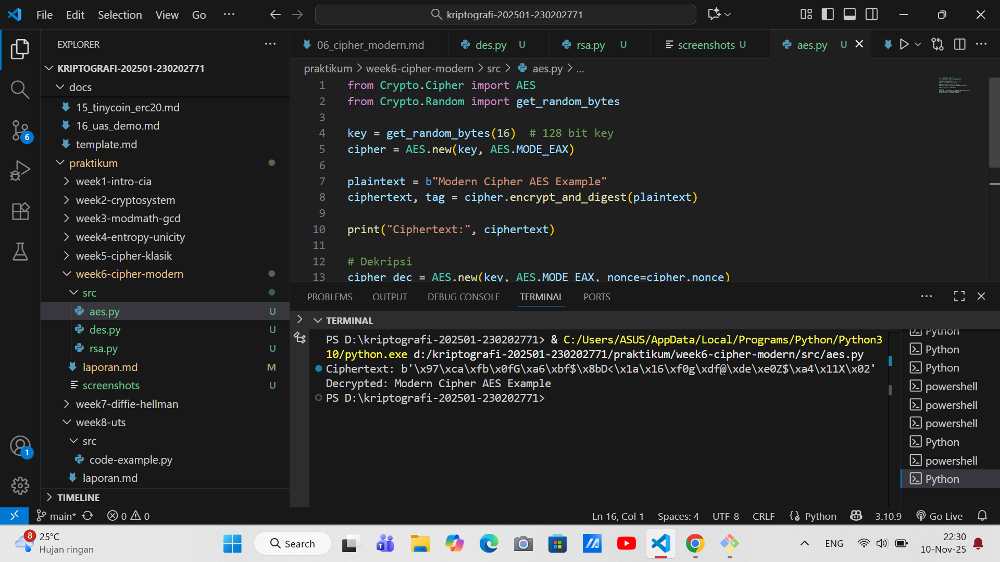
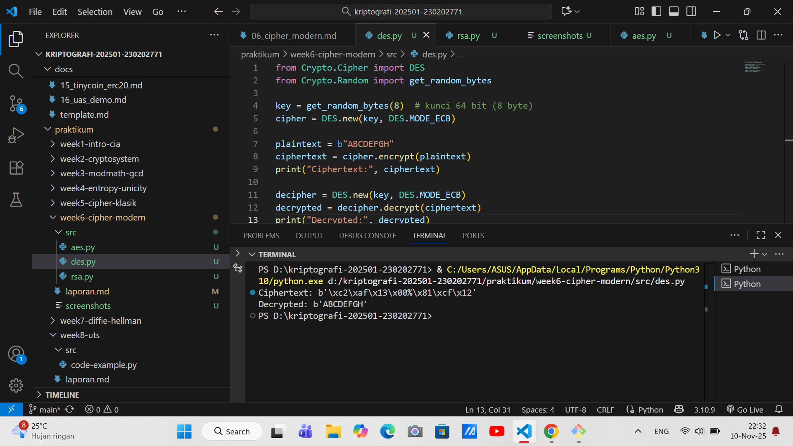

# Laporan Praktikum Kriptografi
Minggu ke-: 6 
Topik: Cipher Modern (DES, AES, RSA)  
Nama: [Naufal Raaid]  
NIM: [230202771]  
Kelas: [5IKRB]  

---

## 1. Tujuan
Setelah mengikuti praktikum ini, mahasiswa diharapkan mampu:  
1. Mengimplementasikan algoritma **DES** untuk blok data sederhana.  
2. Menerapkan algoritma **AES** dengan panjang kunci 128 bit.  
3. Menjelaskan proses pembangkitan kunci publik dan privat pada algoritma **RSA**.  

---

## 2. Dasar Teori
Cipher modern merupakan teknik kriptografi yang digunakan untuk melindungi data digital dengan tingkat keamanan tinggi. Salah satu algoritma awal adalah Data Encryption Standard (DES), yaitu algoritma kriptografi simetris yang menggunakan kunci sepanjang 56 bit dan memproses data dalam blok 64 bit. DES bekerja dengan struktur Feistel Network melalui 16 ronde enkripsi yang melibatkan operasi substitusi dan permutasi. Namun, karena panjang kuncinya terlalu pendek, DES kini dianggap tidak aman dan telah digantikan oleh algoritma yang lebih kuat.

Penerus DES adalah Advanced Encryption Standard (AES), algoritma simetris yang menjadi standar enkripsi modern. AES menggunakan kunci 128, 192, atau 256 bit dan memiliki struktur Substitution–Permutation Network (SPN). Proses enkripsi AES meliputi tahapan SubBytes, ShiftRows, MixColumns, dan AddRoundKey. AES dikenal cepat, efisien, dan memiliki tingkat keamanan tinggi, sehingga banyak digunakan pada berbagai aplikasi keamanan digital seperti VPN, SSL/TLS, dan enkripsi data perangkat.

Berbeda dari dua algoritma sebelumnya, RSA (Rivest–Shamir–Adleman) merupakan algoritma asimetris yang menggunakan sepasang kunci publik dan privat. Keamanannya didasarkan pada kesulitan memfaktorkan bilangan prima besar. RSA digunakan tidak hanya untuk enkripsi data, tetapi juga untuk tanda tangan digital dan pertukaran kunci dalam sistem keamanan modern. Meskipun prosesnya lebih lambat dibanding algoritma simetris seperti AES, RSA tetap menjadi fondasi penting dalam sistem kriptografi modern.

## 3. Alat dan Bahan
(- Python 3.x  
- Visual Studio Code / editor lain  
- Git dan akun GitHub  
- Library tambahan (misalnya pycryptodome, jika diperlukan)  )

---

## 4. Langkah Percobaan
(Tuliskan langkah yang dilakukan sesuai instruksi.  
Contoh format:
1. Membuat file `caesar_cipher.py` di folder `praktikum/week2-cryptosystem/src/`.
2. Menyalin kode program dari panduan praktikum.
3. Menjalankan program dengan perintah `python caesar_cipher.py`.)

---

## 5. Source Code
(Salin kode program utama yang dibuat atau dimodifikasi.  
Gunakan blok kode:

```python
from Crypto.Cipher import DES
from Crypto.Random import get_random_bytes

key = get_random_bytes(8)  # kunci 64 bit (8 byte)
cipher = DES.new(key, DES.MODE_ECB)

plaintext = b"ABCDEFGH"
ciphertext = cipher.encrypt(plaintext)
print("Ciphertext:", ciphertext)

decipher = DES.new(key, DES.MODE_ECB)
decrypted = decipher.decrypt(ciphertext)
print("Decrypted:", decrypted)
```
---

### Langkah 2 — Implementasi AES-128
```python
from Crypto.Cipher import AES
from Crypto.Random import get_random_bytes

key = get_random_bytes(16)  # 128 bit key
cipher = AES.new(key, AES.MODE_EAX)

plaintext = b"Modern Cipher AES Example"
ciphertext, tag = cipher.encrypt_and_digest(plaintext)

print("Ciphertext:", ciphertext)

# Dekripsi
cipher_dec = AES.new(key, AES.MODE_EAX, nonce=cipher.nonce)
decrypted = cipher_dec.decrypt(ciphertext)
print("Decrypted:", decrypted.decode())
```
---

### Langkah 3 — Implementasi RSA
```python
from Crypto.PublicKey import RSA
from Crypto.Cipher import PKCS1_OAEP

# Generate key pair
key = RSA.generate(2048)
private_key = key
public_key = key.publickey()

# Enkripsi dengan public key
cipher_rsa = PKCS1_OAEP.new(public_key)
plaintext = b"RSA Example"
ciphertext = cipher_rsa.encrypt(plaintext)
print("Ciphertext:", ciphertext)

# Dekripsi dengan private key
decipher_rsa = PKCS1_OAEP.new(private_key)
decrypted = decipher_rsa.decrypt(ciphertext)
print("Decrypted:", decrypted.decode())
```
)

---

## 6. Hasil dan Pembahasan
(- Lampirkan screenshot hasil eksekusi program (taruh di folder `screenshots/`).  
- Berikan tabel atau ringkasan hasil uji jika diperlukan.  
- Jelaskan apakah hasil sesuai ekspektasi.  
- Bahas error (jika ada) dan solusinya. 

Hasil eksekusi program Caesar Cipher:




)

---

## 7. Jawaban Pertanyaan
1. Apa perbedaan mendasar antara DES, AES, dan RSA dalam hal kunci dan keamanan?
Jawab:Inti perbedaan:
DES & AES menggunakan satu kunci rahasia bersama (simetris).
RSA menggunakan dua kunci berbeda (asimetris):
Kunci publik untuk enkripsi.
Kunci privat untuk dekripsi.
AES jauh lebih aman dibanding DES karena memiliki panjang kunci yang lebih besar dan struktur matematis yang lebih kompleks.  
2. Mengapa AES lebih banyak digunakan dibanding DES di era modern?  
jawab:Beberapa alasan utama:

Keamanan:
DES hanya memiliki 56 bit key, yang bisa dipecahkan dalam hitungan jam atau bahkan menit dengan hardware modern.
AES memiliki minimal 128 bit key, yang sangat sulit dipecahkan bahkan dengan superkomputer.
Efisiensi:
AES dioptimalkan untuk perangkat keras dan lunak modern, sehingga cepat dan ringan.
DES menggunakan banyak operasi bit-level yang kurang efisien di prosesor modern.
Standarisasi:
AES ditetapkan oleh NIST (National Institute of Standards and Technology) sebagai standar enkripsi sejak tahun 2001, menggantikan DES.
3. Mengapa RSA dikategorikan sebagai algoritma asimetris, dan bagaimana proses pembangkitan kuncinya? 
Jawab:Karena RSA menggunakan dua kunci berbeda:
Kunci publik (Public Key) → untuk mengenkripsi.
Kunci privat (Private Key) → untuk mendekripsi.
Hanya pemilik kunci privat yang bisa membuka pesan yang dienkripsi dengan kunci publiknya.

---

## 8. Kesimpulan
Di era modern, AES digunakan untuk mengenkripsi data, sedangkan RSA digunakan untuk mengamankan distribusi kunci AES.
Kombinasi keduanya membentuk dasar keamanan pada sistem seperti HTTPS, VPN, dan aplikasi pesan terenkripsi.

---

## 9. Daftar Pustaka
(Cantumkan referensi yang digunakan.  
Contoh:  
- Katz, J., & Lindell, Y. *Introduction to Modern Cryptography*.  
- Stallings, W. *Cryptography and Network Security*.  )

---

## 10. Commit Log
commit 08b866fc61014caf1d3e09e85c1de286f841ac28 (HEAD -> main, origin/main, origin/HEAD)
Author: Naufal Raa'id <nraid834@gmail.com>
Date:   Mon Nov 10 23:15:47 2025 +0700

