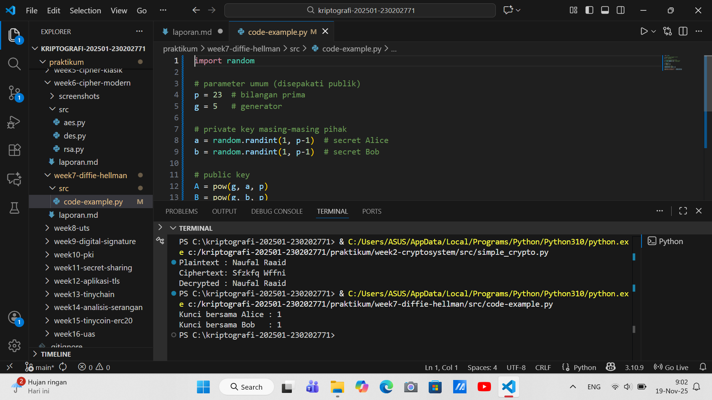

# Laporan Praktikum Kriptografi
Minggu ke-: 7  
Topik: diffie helman
Nama: Naufal Raaid  
NIM: 230202771  
Kelas: 5IKRB 

---

## 1. Tujuan
1. Melakukan simulasi protokol **Diffie-Hellman** untuk pertukaran kunci publik.  
2. Menjelaskan mekanisme pertukaran kunci rahasia menggunakan bilangan prima dan logaritma diskrit.  
3. Menganalisis potensi serangan pada protokol Diffie-Hellman (termasuk serangan **Man-in-the-Middle / MITM**).
---

## 2. Dasar Teori
Diffie–Hellman adalah sebuah protokol pertukaran kunci (key exchange) yang memungkinkan dua pihak yang belum pernah bertemu sebelumnya untuk menyepakati sebuah kunci rahasia bersama melalui saluran komunikasi yang tidak aman. Inti dari protokol ini berada pada konsep logaritma diskret, yaitu masalah matematika yang sulit diselesaikan: meskipun mudah menghitung ( g^a \mod p ), sangat sulit untuk mencari nilai ( a ) hanya dari hasil tersebut. Kesulitan inilah yang membuat Diffie–Hellman aman terhadap penyadapan pasif.

Dalam prosesnya, kedua pihak memilih sebuah bilangan prima besar ( p ) dan generator ( g ). Masing-masing kemudian memilih bilangan rahasia (private key) mereka, menghitung nilai publiknya menggunakan operasi perpangkatan modulo, lalu saling bertukar nilai publik tersebut. Dengan melakukan perpangkatan sekali lagi menggunakan nilai publik lawan, keduanya akan mendapatkan kunci yang sama, yaitu ( g^{ab} \mod p ), tanpa pernah mengirimkan kunci rahasia itu secara langsung.

Keamanan protokol ini bergantung pada asumsi bahwa penyerang tidak dapat menyelesaikan masalah logaritma diskret dalam waktu yang layak. Namun, Diffie–Hellman klasik rentan terhadap serangan **man-in-the-middle** jika tidak dilengkapi mekanisme autentikasi, karena penyerang dapat menyusup di tengah dan membentuk dua kunci terpisah dengan kedua pihak. Oleh karena itu, implementasi modern biasanya menggabungkan Diffie–Hellman dengan tanda tangan digital atau protokol autentikasi lainnya.


---

## 3. Alat dan Bahan
(- Python 3.x  
- Visual Studio Code / editor lain  
- Git dan akun GitHub  
- Library tambahan (misalnya pycryptodome, jika diperlukan)  )

---

## 4. Langkah Percobaan
(Tuliskan langkah yang dilakukan sesuai instruksi.  
Contoh format:
1. Membuat file `diffie_helman.py` di folder `praktikum/week7-diffie-hellman/src/`.
2. Menyalin kode program dari panduan praktikum.
3. Menjalankan program dengan perintah `python diffie_helman.py`.)

---

## 5. Source Code
(Salin kode program utama yang dibuat atau dimodifikasi.  
Gunakan blok kode:

```python
import random

# parameter umum (disepakati publik)
p = 23  # bilangan prima
g = 5   # generator

# private key masing-masing pihak
a = random.randint(1, p-1)  # secret Alice
b = random.randint(1, p-1)  # secret Bob

# public key
A = pow(g, a, p)
B = pow(g, b, p)

# exchange public key
shared_secret_A = pow(B, a, p)
shared_secret_B = pow(A, b, p)

print("Kunci bersama Alice :", shared_secret_A)
print("Kunci bersama Bob   :", shared_secret_B)
```
)

---

## 6. Hasil dan Pembahasan
(- Lampirkan screenshot hasil eksekusi program (taruh di folder `screenshots/`).  
- Berikan tabel atau ringkasan hasil uji jika diperlukan.  
- Jelaskan apakah hasil sesuai ekspektasi.  
- Bahas error (jika ada) dan solusinya. 

Hasil eksekusi program Caesar Cipher:



)

---

## 7. Jawaban Pertanyaan
1. Mengapa Diffie-Hellman memungkinkan pertukaran kunci di saluran publik? 
jawab:Diffie-Hellman memungkinkan dua pihak (misalnya, Alice dan Bob) untuk membuat kunci rahasia bersama melalui saluran komunikasi yang tidak aman (publik) berkat properti dari aritmetika modular dan masalah logaritma diskrit (Discrete Logarithm Problem - DLP).Prosesnya melibatkan langkah-langkah berikut:Nilai Publik Bersama: Alice dan Bob menyetujui dua nilai publik: bilangan prima besar $p$ (modulus) dan bilangan $g$ (generator). Nilai-nilai ini tidak rahasia.Pilihan Rahasia Pribadi:Alice memilih bilangan bulat rahasia pribadi $a$.Bob memilih bilangan bulat rahasia pribadi $b$.Pertukaran Nilai Publik:Alice menghitung nilai publiknya $A = g^a \pmod{p}$ dan mengirimkannya ke Bob.Bob menghitung nilai publiknya $B = g^b \pmod{p}$ dan mengirimkannya ke Alice.Pihak ketiga (Eve) dapat melihat $A$ dan $B$, tetapi tidak $a$ atau $b$.Penghitungan Kunci Rahasia Bersama:Alice menghitung kunci bersama $K$ menggunakan nilai publik Bob dan rahasia pribadinya: $K = B^a \pmod{p}$.Bob menghitung kunci bersama $K$ menggunakan nilai publik Alice dan rahasia pribadinya: $K = A^b \pmod{p}$.Karena $B^a \pmod{p} = (g^b)^a \pmod{p} = g^{ab} \pmod{p}$ dan $A^b \pmod{p} = (g^a)^b \pmod{p} = g^{ab} \pmod{p}$, maka kunci bersama ($K$) yang dihasilkan Alice dan Bob adalah sama dan hanya mereka yang tahu.Kekuatan DLP: Bagi Eve yang melihat $g$, $p$, $A$, dan $B$, sangat sulit secara komputasi untuk menemukan $a$ (dari $A = g^a \pmod{p}$) atau $b$ (dari $B = g^b \pmod{p}$). Eve harus memecahkan Masalah Logaritma Diskrit (DLP), yang tidak mungkin dilakukan dalam waktu yang wajar dengan parameter yang cukup besar. 
2. Apa kelemahan utama protokol Diffie-Hellman murni?
Jawab:Kelemahan utama protokol Diffie-Hellman murni adalah kurangnya autentikasi, yang membuatnya rentan terhadap Serangan Man-in-the-Middle (MITM).Dalam protokol murni, Alice dan Bob tidak memiliki cara untuk memverifikasi identitas pihak yang mereka ajak bertukar kunci.Serangan Man-in-the-Middle (MITM):Intersepsi: Eve mencegat nilai publik $A$ dari Alice yang ditujukan untuk Bob.Pembuatan Kunci:Eve memilih rahasia pribadinya sendiri, $e$.Eve menghitung nilai publiknya $E = g^e \pmod{p}$.Penipuan:Eve mengirimkan $E$ ke Bob (berpura-pura bahwa $E$ adalah $A$ milik Alice).Eve mengirimkan $E$ ke Alice (berpura-pura bahwa $E$ adalah $B$ milik Bob).Dua Kunci Bersama:Alice menghitung kunci rahasia bersama dengan Eve: $K_{AE} = E^a \pmod{p}$.Bob menghitung kunci rahasia bersama dengan Eve: $K_{BE} = E^b \pmod{p}$.Alice dan Bob berpikir mereka telah berbagi kunci rahasia satu sama lain, padahal mereka berdua berbagi kunci rahasia dengan Eve.Penyadapan Penuh: Saat Alice mengirim pesan terenkripsi ke Bob menggunakan $K_{AE}$, Eve mencegatnya, mendekripsinya menggunakan $K_{AE}$, membaca/memodifikasi pesan tersebut, mengenkripsinya kembali menggunakan $K_{BE}$, dan mengirimkannya ke Bob. Begitu juga sebaliknya.  
3. Bagaimana cara mencegah serangan MITM pada protokol ini? 
jawab:Untuk mencegah serangan MITM, protokol Diffie-Hellman harus diperkuat dengan mekanisme autentikasi yang memungkinkan Alice dan Bob untuk memverifikasi identitas masing-masing.Metode yang umum digunakan meliputi:A. Penggunaan Sertifikat Digital (PKI - Public Key Infrastructure)Ini adalah metode yang paling umum, digunakan dalam protokol seperti TLS/SSL.Setiap pihak (terutama server) memiliki kunci publik statis yang disertifikasi oleh Otoritas Sertifikat (CA) tepercaya.Setelah langkah pertukaran Diffie-Hellman (disebut Ephemeral Diffie-Hellman atau DHE/ECDHE), kunci sesi yang dihasilkan digunakan untuk menandatangani (sign) sebagian dari transaksi.Penandatanganan ini membuktikan kepemilikan kunci publik statis, yang diverifikasi oleh pihak lain menggunakan sertifikat CA. Jika Eve mencoba menggunakan kunci palsu, tanda tangannya akan gagal diverifikasi.B. Diffie-Hellman StatisMenggunakan nilai publik pribadi ($a$ dan $b$) yang statis (tidak berubah) untuk setiap sesi.Meskipun menghilangkan MITM karena $A$ dan $B$ diverifikasi sebagai bagian dari sertifikat statis, ini memiliki kelemahan: kurangnya Forward Secrecy. Jika kunci pribadi statis ($a$ atau $b$) bocor di masa mendatang, semua sesi masa lalu dapat didekripsi.C. Autentikasi Menggunakan Kunci Rahasia Pra-bagi (Pre-Shared Key - PSK)Alice dan Bob sudah memiliki kunci rahasia bersama yang disepakati sebelumnya (PSK).Kunci sesi yang dihasilkan oleh Diffie-Hellman digunakan bersama dengan PSK untuk menghasilkan kunci otentikasi (misalnya menggunakan fungsi HMAC) yang kemudian digunakan untuk memverifikasi keaslian pesan pertukaran. Ini umum dalam konfigurasi IPsec VPN. 

---

## 8. Kesimpulan
Protokol Diffie-Hellman memungkinkan dua pihak yang tidak saling mengenal untuk menghasilkan kunci rahasia bersama melalui saluran publik dengan memanfaatkan kesulitan komputasi Masalah Logaritma Diskrit (DLP). Namun, kelemahan mendasar protokol murni ini adalah kurangnya autentikasi, yang membuatnya sangat rentan terhadap Serangan Man-in-the-Middle (MITM). Oleh karena itu, DH harus diperkuat dengan sertifikat digital atau mekanisme autentikasi lainnya untuk menjamin keamanan dan keaslian pertukaran.

---

## 9. Daftar Pustaka
(Cantumkan referensi yang digunakan.  
Contoh:  
- Katz, J., & Lindell, Y. *Introduction to Modern Cryptography*.  
- Stallings, W. *Cryptography and Network Security*.  )

---

## 10. Commit Log
(Tuliskan bukti commit Git yang relevan.  
Contoh:
```
commit abc12345
Author: Nama Mahasiswa <email>
Date:   2025-09-20

    week2-cryptosystem: implementasi Caesar Cipher dan laporan )
```
