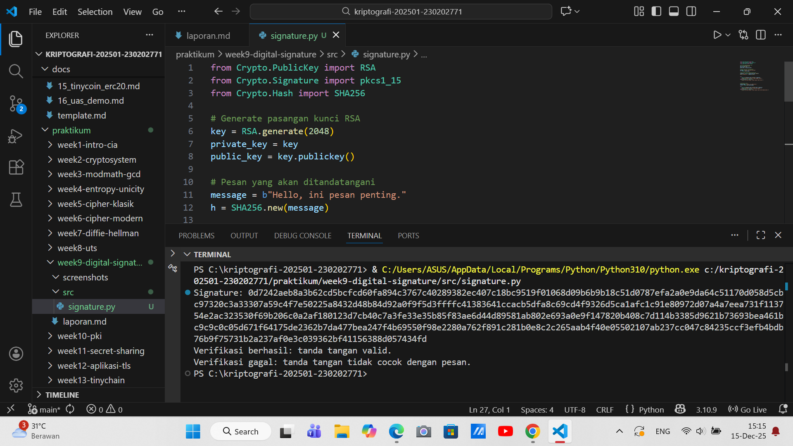

# Laporan Praktikum Kriptografi
Minggu ke-: 9 
Topik:digital-signature 
Nama: Naufal Raaid  
NIM: 230202771  
Kelas:  5IKRB   

---

## 1. Tujuan
1. Mengimplementasikan tanda tangan digital menggunakan algoritma RSA/DSA.  
2. Memverifikasi keaslian tanda tangan digital.  
3. Menjelaskan manfaat tanda tangan digital dalam otentikasi pesan dan integritas data.  

---

## 2. Dasar Teori
Tanda Tangan Digital (Digital Signature) adalah mekanisme kriptografi yang berfungsi untuk memastikan keaslian, integritas, dan non-repudiasi dari suatu pesan atau dokumen digital. Secara fundamental, proses ini mirip dengan tanda tangan tulisan tangan di dunia nyata, tetapi dengan jaminan matematis yang jauh lebih kuat. Sistem Tanda Tangan Digital berbasis pada kriptografi kunci publik (asimetris). Setiap pengguna memiliki sepasang kunci: Kunci Privat (Private Key), yang dirahasiakan dan digunakan hanya untuk menandatangani, serta Kunci Publik (Public Key), yang dibagikan secara luas dan digunakan untuk memverifikasi tanda tangan tersebut.

Proses penandatanganan melibatkan dua langkah utama. Pertama, pengirim menjalankan pesan asli melalui fungsi hash kriptografi (misalnya, SHA-256) untuk menghasilkan nilai hash (atau message digest) dengan panjang tetap. Nilai hash ini mewakili sidik jari unik dari pesan. Kedua, nilai hash tersebut kemudian dienkripsi menggunakan Kunci Privat milik pengirim. Hasil enkripsi inilah yang disebut sebagai Tanda Tangan Digital. Tanda tangan digital ini lalu dilampirkan bersama pesan asli dan dikirimkan kepada penerima.

Ketika penerima menerima pesan dan tanda tangan yang menyertainya, proses verifikasi pun dimulai. Penerima melakukan tiga tindakan: 
1. Menghasilkan ulang nilai hash dari pesan asli yang ia terima. 
2. Mendekripsi Tanda Tangan Digital yang diterima menggunakan Kunci Publik milik pengirim. 
3. Membandingkan nilai hash yang dihasilkan ulang (langkah 1) dengan nilai hash hasil dekripsi (langkah 2). Jika kedua nilai hash tersebut sama, maka tiga jaminan terpenuhi: Integritas (pesan tidak berubah), Keaslian (pesan benar-benar dikirim oleh pemilik Kunci Privat), dan Non-Repudiasi (pengirim tidak dapat menyangkal telah mengirim pesan tersebut).

---

## 3. Alat dan Bahan
(- Python 3.x  
- Visual Studio Code / editor lain  
- Git dan akun GitHub  
- Library tambahan (misalnya pycryptodome, jika diperlukan)  )

---

## 4. Langkah Percobaan
(Tuliskan langkah yang dilakukan sesuai instruksi.  
Contoh format:
1. Membuat file `digital_signature.py` di folder `praktikum/week9-digital-signature/src/`.
2. Menyalin kode program dari panduan praktikum.
3. Menjalankan program dengan perintah `python digital_signature.py`.)

---

## 5. Source Code
(Salin kode program utama yang dibuat atau dimodifikasi.  
Gunakan blok kode:

```python
from Crypto.PublicKey import RSA
from Crypto.Signature import pkcs1_15
from Crypto.Hash import SHA256

# Generate pasangan kunci RSA
key = RSA.generate(2048)
private_key = key
public_key = key.publickey()

# Pesan yang akan ditandatangani
message = b"Hello, ini pesan penting."
h = SHA256.new(message)

# Buat tanda tangan dengan private key
signature = pkcs1_15.new(private_key).sign(h)
print("Signature:", signature.hex())

try:
    pkcs1_15.new(public_key).verify(h, signature)
    print("Verifikasi berhasil: tanda tangan valid.")
except (ValueError, TypeError):
    print("Verifikasi gagal: tanda tangan tidak valid.")

# Modifikasi pesan
fake_message = b"Hello, ini pesan palsu."
h_fake = SHA256.new(fake_message)

try:
    pkcs1_15.new(public_key).verify(h_fake, signature)
    print("Verifikasi berhasil (seharusnya gagal).")
except (ValueError, TypeError):
    print("Verifikasi gagal: tanda tangan tidak cocok dengan pesan.")
```

---

## 6. Hasil dan Pembahasan
(- Lampirkan screenshot hasil eksekusi program (taruh di folder `screenshots/`).  
- Berikan tabel atau ringkasan hasil uji jika diperlukan.  
- Jelaskan apakah hasil sesuai ekspektasi.  
- Bahas error (jika ada) dan solusinya. 

Hasil eksekusi program Caesar Cipher:


)

---

## 7. Jawaban Pertanyaan
1. Apa perbedaan utama antara enkripsi RSA dan tanda tangan digital RSA? 
Jawab:Perbedaan utama terletak pada tujuan dan penggunaan kuncinya.
Tujuan: Enkripsi RSA bertujuan untuk menjamin kerahasiaan (confidentiality) data, memastikan hanya penerima yang berhak yang dapat membaca pesan. Sebaliknya, Tanda Tangan Digital RSA bertujuan untuk menjamin otentikasi, integritas, dan non-repudiasi (membuktikan pengirim asli dan keutuhan pesan).

Penggunaan Kunci: Dalam Enkripsi RSA, pengirim menggunakan Kunci Publik Penerima untuk mengunci (enkripsi) pesan. Dalam Tanda Tangan Digital RSA, pengirim menggunakan Kunci Privatnya sendiri untuk mengunci (menandatangani) nilai hash dari pesan. Penggunaan kunci yang berlawanan ini menentukan fungsi keamanannya masing-masing.

2. Mengapa tanda tangan digital menjamin integritas dan otentikasi pesan?
Jawab:Tanda Tangan Digital menjamin properti ini melalui proses matematis yang mengikat pesan dan pengirim. Otentikasi terjamin karena tanda tangan dibuat menggunakan Kunci Privat rahasia pengirim—hanya pemilik kunci tersebut yang bisa membuatnya. Integritas terjamin melalui penggunaan Fungsi Hash; pesan diubah menjadi sidik jari unik (hash) sebelum ditandatangani. Saat verifikasi, penerima menghitung ulang hash dan membandingkannya dengan hash yang terdekripsi dari tanda tangan. Jika kedua nilai hash ini berbeda, maka pesan telah diubah (integritas gagal).

3. Bagaimana peran Certificate Authority (CA) dalam sistem tanda tangan digital modern?  
Jawab:Peran utama Certificate Authority (CA) adalah membangun dan memelihara kepercayaan (trust) dalam sistem kunci publik. CA bertindak sebagai pihak ketiga tepercaya yang memverifikasi identitas seseorang atau organisasi. Setelah identitas diverifikasi, CA mengeluarkan Sertifikat Digital yang secara resmi mengikat Kunci Publik mereka dengan identitas yang sah tersebut. Dengan menandatangani sertifikat menggunakan Kunci Privatnya sendiri, CA memastikan bahwa penerima dapat memercayai Kunci Publik yang disajikan, mencegah penipuan dan serangan Man-in-the-Middle dalam skala luas.

---

## 8. Kesimpulan
Berdasarkan pembahasan mengenai analisis risiko keamanan informasi dengan standar ISO/IEC 27001 dan ISO/IEC 27005, dapat disimpulkan bahwa pengelolaan keamanan informasi merupakan kebutuhan penting bagi organisasi, khususnya instansi pemerintah, untuk melindungi aset informasi dari berbagai ancaman. Penerapan manajemen risiko yang terstruktur memungkinkan organisasi mengidentifikasi, menganalisis, serta memitigasi risiko secara sistematis sehingga dampak gangguan terhadap proses bisnis dapat diminimalkan.

Dalam konteks tersebut, digital signature berperan sebagai salah satu mekanisme pengamanan yang mendukung prinsip confidentiality, integrity, dan non-repudiation. Penggunaan digital signature mampu menjamin keaslian dokumen elektronik, mencegah perubahan data yang tidak sah, serta memberikan bukti autentikasi yang kuat terhadap identitas penandatangan. Dengan demikian, penerapan digital signature tidak hanya meningkatkan kepercayaan dan keamanan pertukaran informasi digital, tetapi juga mendukung kepatuhan terhadap standar keamanan informasi yang ditetapkan dalam ISO/IEC 27001.

Secara keseluruhan, integrasi manajemen risiko keamanan informasi dengan penerapan teknologi seperti digital signature dapat membantu organisasi meningkatkan perlindungan data, efisiensi proses kerja, serta kualitas layanan publik secara berkelanjutan.

---

## 9. Daftar Pustaka
(Cantumkan referensi yang digunakan.  
Contoh:  
- Katz, J., & Lindell, Y. *Introduction to Modern Cryptography*.  
- Stallings, W. *Cryptography and Network Security*.  )

---

## 10. Commit Log
```
commit 3ec28a8b9449c11a020500b0ee85128704da20d1 (HEAD -> main, origin/main, origin/HEAD)
Author: Naufal Raaid <nraid834@gmail.com>
Date:   Mon Dec 15 14:49:06 2025 +0700

    week9-digital-signature
```